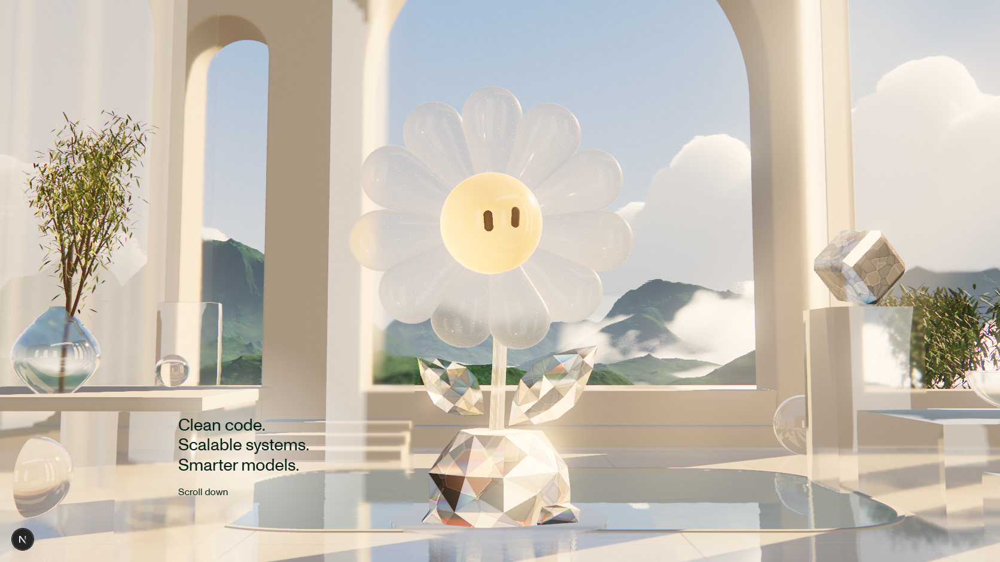

# Triển khai sau audit — Crystal Flower Pavilion

Ngày: 2026-10-07. Phạm vi: `/playground` theo [audit](README.md) và [handoff](CLAUDE_HANDOFF.md). Giữ Three.js thuần, `WebglManager`, camera/intro/transition, copy DOM, tuyến home/about.

## Trước / sau

| Trước | Sau |
|---|---|
|  |  |

Bộ ảnh sau (chụp ngày 07/10; script `scripts/capture-playground-crystal.mjs` nay ghi bộ ảnh của lần triển khai 08/10 vào `audit-2026-10-08/after/`):

| Ảnh | Thiết lập |
|---|---|
| [01-final](evidence/after/01-final.png) | 1672 × 941, DPR 1, `quality=high` (HDR 100 %, refraction 100 %, mirror 100 % mỗi frame), MSAA 4 |
| [02-bloom-off](evidence/after/02-bloom-off.png) | như 01, tắt bloom, star streaks, glare, light shafts — crystal vẫn đọc là crystal |
| [03-debug-glass](evidence/after/03-debug-glass.png) | `debug=glass`: tắt glitter, milk, translucency, sun glints của tracer |
| [04-debug-unpatched](evidence/after/04-debug-unpatched.png) | `debug=unpatched`: mọi vật liệu patch thay bằng `MeshPhysicalMaterial` gốc (baseline A/B) |
| [05-florere-lineup](evidence/after/05-florere-lineup.png) | `debug=florere`, DPR 2: sáu mẫu cạnh nhau, không daisy |
| [06-wide-2560](evidence/after/06-wide-2560.png) | 2560 × 1264 |
| [07-mobile](evidence/after/07-mobile.png) / [08-tablet](evidence/after/08-tablet.png) | 390 × 844 DPR 2, 1024 × 768 (tier lite) |

Không có `pageerror`/console error trong 8 lần chụp ([capture.json](evidence/after/capture.json)).

## Đã làm

**Quang học crystal (P0).** Bỏ hẳn Voronoi nội khối, random refraction-normal, viền tối theo tam giác và "fire" tự dựng (`shaders/crystal.ts`). Thay bằng `shaders/crystalTrace.ts`: mỗi crystal là một khối lồi kín với các mặt phẳng thật (`cut.ts`); trong fragment, tia nhìn khúc xạ vào qua mặt trước, nảy trong khối (tối đa 2–4 lần) với Fresnel/TIR đúng, phần thoát ra khúc xạ riêng R/G/B (dispersion vật lý, spread nhỏ). Lần thoát đầu lấy mẫu refraction buffer (cảnh phía sau), các lần sau lấy environment map. Màu crystal theo Beer–Lambert trên đường đi thật (mỏng thì nhạt, dày thì đậm). Không còn thông số `thickness` đoán. Hỗ trợ `InstancedMesh` (transform qua flat varyings).

**Daisy.** Giữ rig mở cánh, mắt, chớp mắt. Lá: cắt marquise lồi có gân giữa. Đế: một viên cushion-cut thiết kế theo vòng (không còn random hull) + hai viên nhỏ. Cánh: frosted trong mờ, viền sáng (light piping), hai lớp glitter ổn định trong không gian vật thể.

**Sáu loài Florere** (`florere/species.ts`), dựng theo ảnh sản phẩm, đơn vị "1 = chiều cao figurine": Rose (tim xoắn + 3/5/5 cánh), Forget-me-not (9 bông 5 cánh, mắt vàng, 2 nụ), Rozanne (2 bông tím, tâm tím đậm, đài vàng, 2 nụ), Lily (6 cánh vàng, họng hổ phách, nhị), Lily of the Valley (đế cắt mặt hình giọt, thân/lá sơn xanh, 8 chuông trong, ngọc trai), Blue Bellflower (3 chuông xanh đậm có 5 thùy loe, 2 nụ, thân móc). Thân champagne gold quấn quanh đế đá tự nhiên; lá crystal xanh nhạt.

**Garden.** `GARDEN` trong `layout.ts`, giải bằng phép chiếu của rig: Rose trái giữa (48 % chiều cao daisy), Forget-me-not trước trái (54 %), Bellflower sau trái (38 %), Lily trước phải (51 %), Rozanne sau phải (41 %), LotV rìa phải (46 %). Không che mặt daisy hay khối copy. Bỏ cube/bowl/ledge/prism/vase cũ; thêm bệ marble, khối kính, cầu kính, chậu olive, bụi hoa trắng, cypress sau lan can. Hồ thu nhỏ quanh đế daisy.

**Độ trong / "sương mù".** Nguyên nhân thật: rèm voan che 1/3 trái, tấm kính lớn trước trụ trái, veil ấm toàn khung trong post, bloom ngưỡng 1.25 làm cả mảng marble phát sáng, refraction 45 %. Đã bỏ rèm và tấm kính, bỏ veil, bloom chỉ còn cho glint/sun (ngưỡng 2.6), refraction 80 % desktop (100 % khi `quality=high`), thêm contrast-adaptive sharpen. Trời xanh đậm hơn, haze núi/mây giảm.

**Ánh sáng chiếu vào hero.** Light shafts quarter-res hướng về vị trí mặt trời chiếu thật mỗi frame (trụ và cột cắt thành tia), ba dải sáng mềm đi qua daisy, star streaks bốn cánh trên glint sáng nhất, caustic sàn dời về đúng chỗ các crystal mới.

**Debug và chất lượng.** `debug=glass` giờ thật sự tắt mọi stylization; thêm `debug=unpatched`, `debug=florere`; anchor shader thiếu sẽ cảnh báo ở development. `quality=high` = HDR, refraction, mirror 100 %, mirror mỗi frame. Tier lite (≤ tablet): không MSAA, không streaks/shafts/sharpen, refraction 50 %.

## Đo đạc

RTX 4070 SUPER, Chromium/ANGLE D3D11, dev build: thời gian từ `update()` đến `gl.finish()` mỗi frame được render ≈ 2.5 ms trung bình (p95 ≈ 5 ms) ở 1672 × 941 và ≈ 2.6 ms ở 2560 × 1440. `gl.finish` trong Chrome là xấp xỉ, không phải GPU timer query; chưa đo trên GPU tích hợp hay mobile thật (adaptive resolution và tier lite vẫn giữ nguyên cơ chế). `npm run check` pass. Điều hướng home → playground → about → playground không lỗi.

## Giới hạn quang học còn lại (thật)

- Mỗi crystal chỉ tự truy vết trong chính nó. Refraction buffer của three.js không chứa vật thể transmissive khác, nên crystal không nhìn thấy crystal khác hay cánh daisy phía sau nó; các cánh hồng chồng nhau không khúc xạ qua nhau.
- Tia thoát sau lần nảy đầu lấy environment map chụp từ đầu daisy: không có parallax đúng cho từng vị trí.
- Caustic sàn vẫn là pattern thủ tục đặt theo vị trí crystal, không phải truyền sáng vật lý. Light shafts là hiệu ứng màn hình.
- Chỉ khối lồi được truy vết. Cánh hồng, cánh lily, chuông là xấp xỉ lồi (chip dày): không có lòng chuông rỗng, cánh lily không cong ngược. Phần khuất của sản phẩm (mặt sau, mối nối) là tự thiết kế, không đo.
- Chưa có GLB authored; model là code. Màu là màu sản phẩm gốc, chưa có preset recolor theo moodboard.
