# Evidence index — mở ảnh thật trước khi code

Có **45 ảnh** trong gói self-contained này. Mỗi mục có link/embedded image; Claude phải dùng image read tool mở file thật, không chỉ đọc alt text. Manifest JSON chứa kích thước/SHA-256 và source fingerprints.

Ưu tiên: yêu cầu mới bỏ cây thật → original cuối → boards/ảnh Swarovski → runtime diagnostics → lịch sử. Original có foliage không cho phép giữ cây thật. Ba screenshot chat hiện tại không có raw local path; ảnh09/16/17 là capture/crop tái lập và đã ghi nhãn trung thực.

## A. Originals, boards và sáu sản phẩm

### 00-user-original-target.png

- [ ] Đã mở [references/00-user-original-target.png](references/00-user-original-target.png) — 1672×941.

CHUẨN ĐÍCH CHÍNH — ảnh cuối người dùng muốn. Foliage thật trong ảnh không được đưa lại vì yêu cầu mới ưu tiên bỏ cây thật.

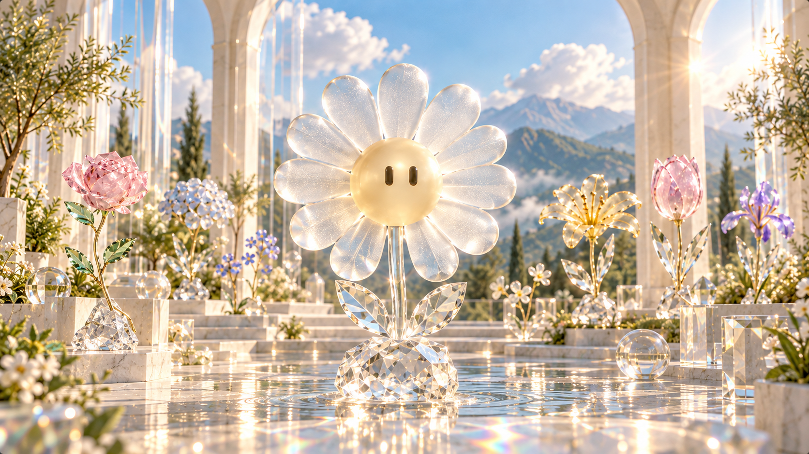

### 01-user-pavilion-design-board.png

- [ ] Đã mở [references/01-user-pavilion-design-board.png](references/01-user-pavilion-design-board.png) — 1672×941.

Moodboard đã xuất hiện trong cuộc trò chuyện, copy nguyên byte. Lấy composition/material; bỏ natural plants, không tự thêm mọi species.

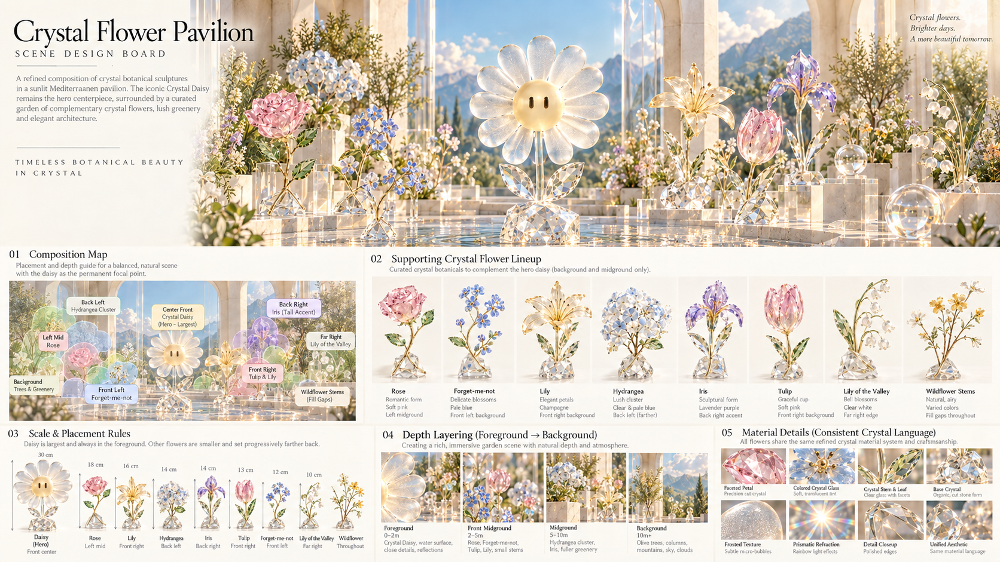

### 02-user-alternative-flower-board.png

- [ ] Đã mở [references/02-user-alternative-flower-board.png](references/02-user-alternative-flower-board.png) — 1672×941.

Moodboard chi tiết cánh/thân/lá và palette. Không thay thế original cuối hoặc sáu sản phẩm yêu cầu.

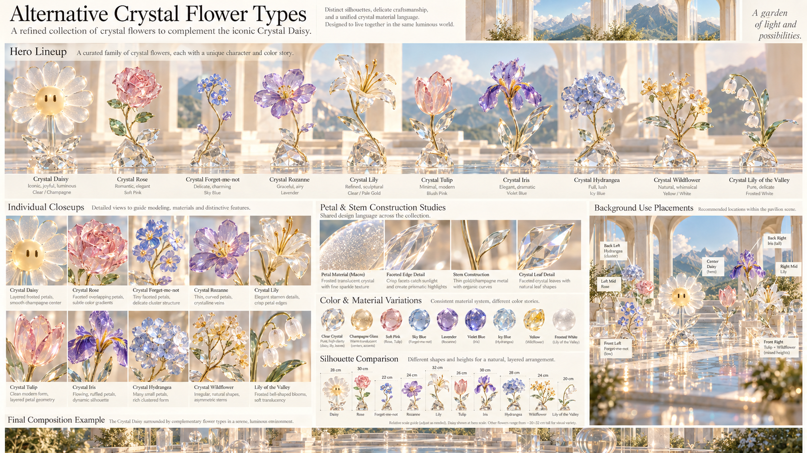

### 03-previous-project-reference.png

- [ ] Đã mở [references/03-previous-project-reference.png](references/03-previous-project-reference.png) — 1672×941.

Original dự án cũ: tham chiếu phụ cho độ trong/độ rõ hero; không phải đích cuối của lần sửa này.

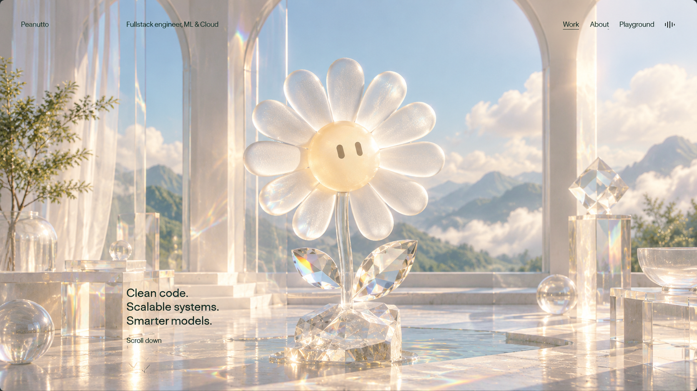

### 5666971-forget-me-not.jpg

- [ ] Đã mở [references/5666971-forget-me-not.jpg](references/5666971-forget-me-not.jpg) — 1000×1000.

Ảnh sản phẩm Swarovski: chuẩn identity, silhouette, gold/green parts; không phải model3D.

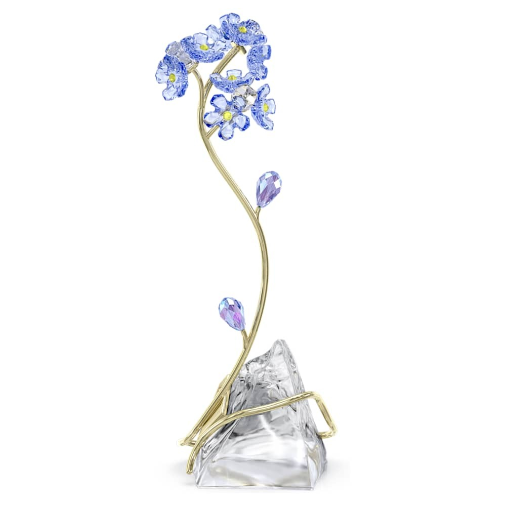

### 5666972-lily.jpg

- [ ] Đã mở [references/5666972-lily.jpg](references/5666972-lily.jpg) — 1000×1000.

Ảnh sản phẩm Swarovski: chuẩn identity, silhouette, gold/green parts; không phải model3D.

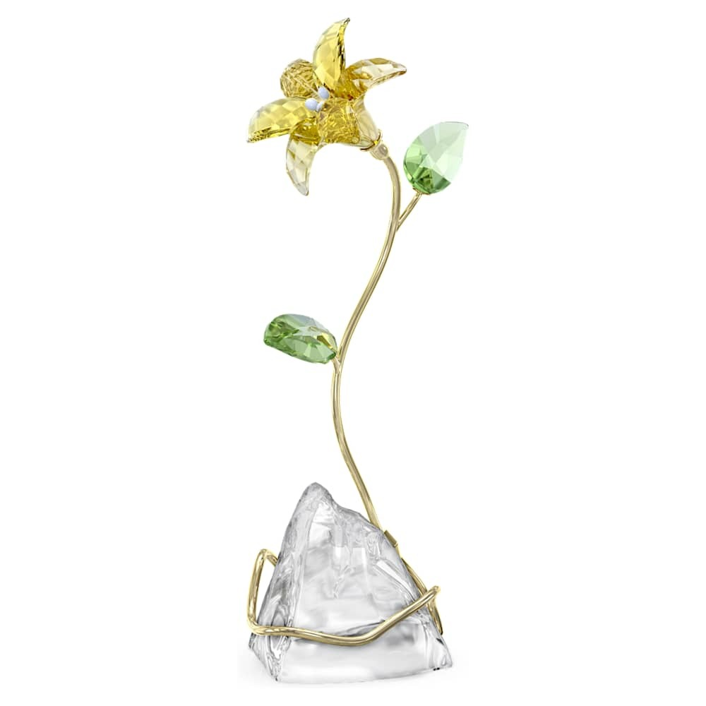

### 5666973-rose.jpg

- [ ] Đã mở [references/5666973-rose.jpg](references/5666973-rose.jpg) — 1000×1000.

Ảnh sản phẩm Swarovski: chuẩn identity, silhouette, gold/green parts; không phải model3D.

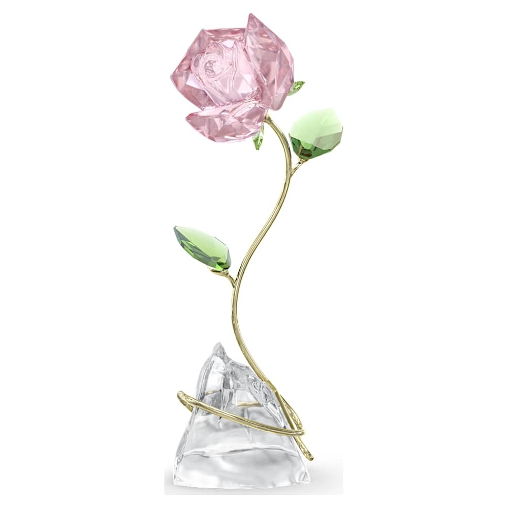

### 5693143-rozanne.jpg

- [ ] Đã mở [references/5693143-rozanne.jpg](references/5693143-rozanne.jpg) — 1000×1000.

Ảnh sản phẩm Swarovski: chuẩn identity, silhouette, gold/green parts; không phải model3D.

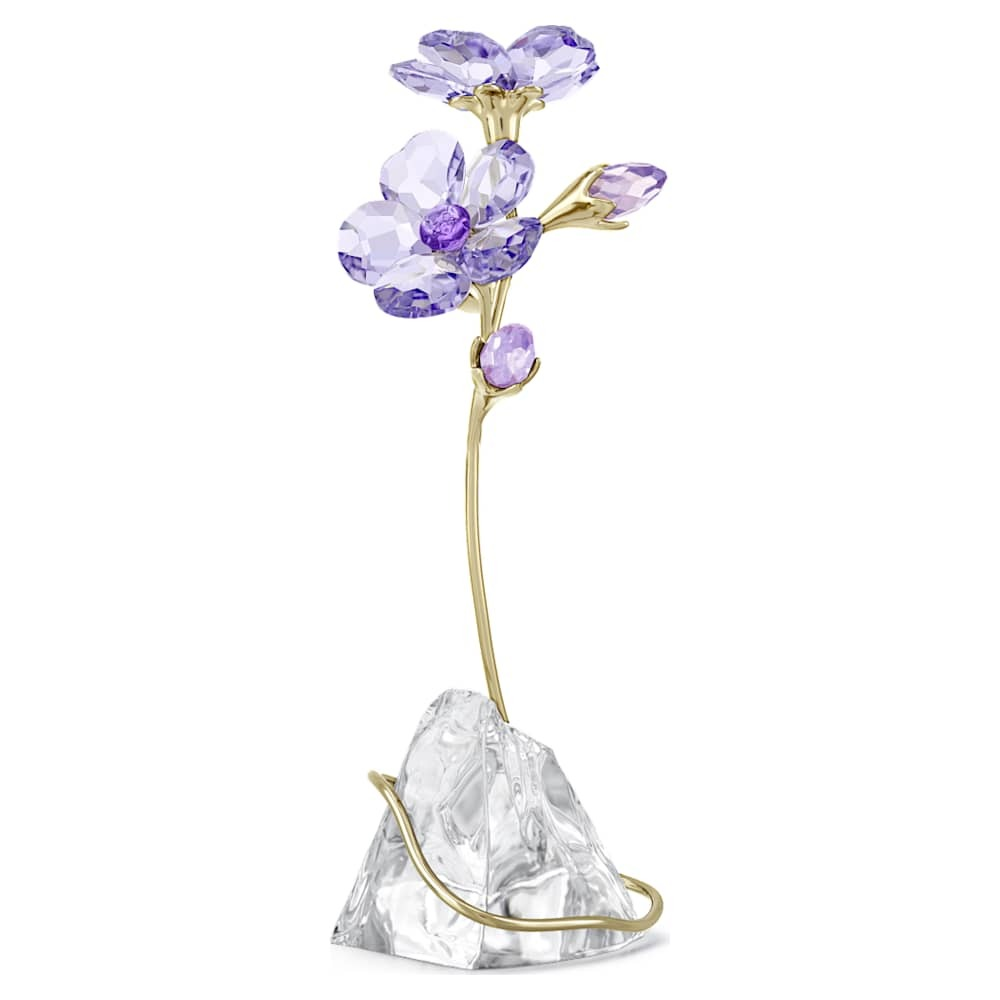

### 5719807-blue-bellflower.jpg

- [ ] Đã mở [references/5719807-blue-bellflower.jpg](references/5719807-blue-bellflower.jpg) — 1000×1000.

Ảnh sản phẩm Swarovski: chuẩn identity, silhouette, gold/green parts; không phải model3D.

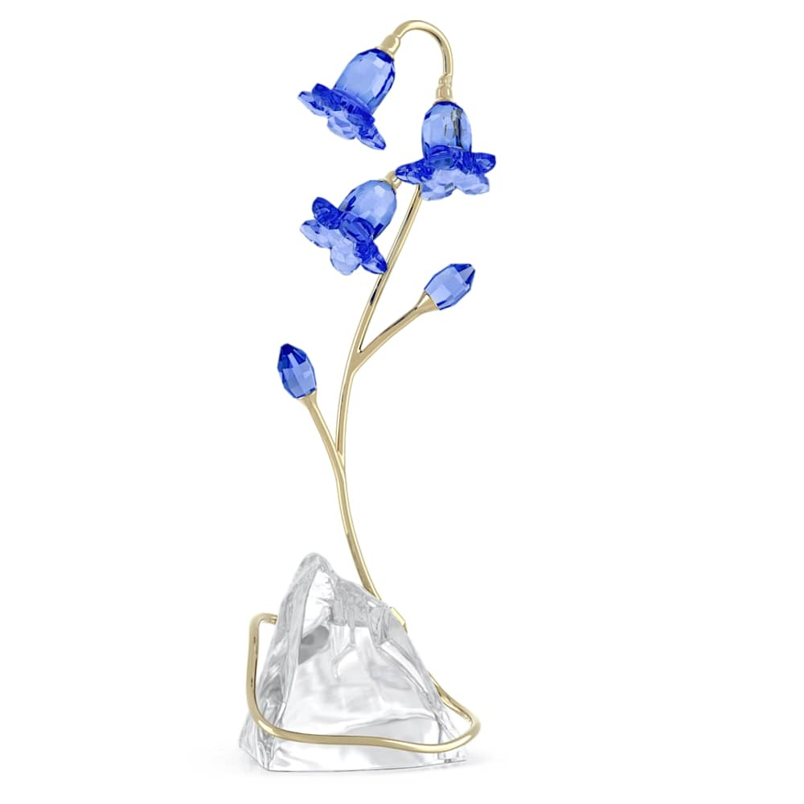

### 5721541-lily-of-the-valley.jpg

- [ ] Đã mở [references/5721541-lily-of-the-valley.jpg](references/5721541-lily-of-the-valley.jpg) — 1000×1000.

Ảnh sản phẩm Swarovski: chuẩn identity, silhouette, gold/green parts; không phải model3D.

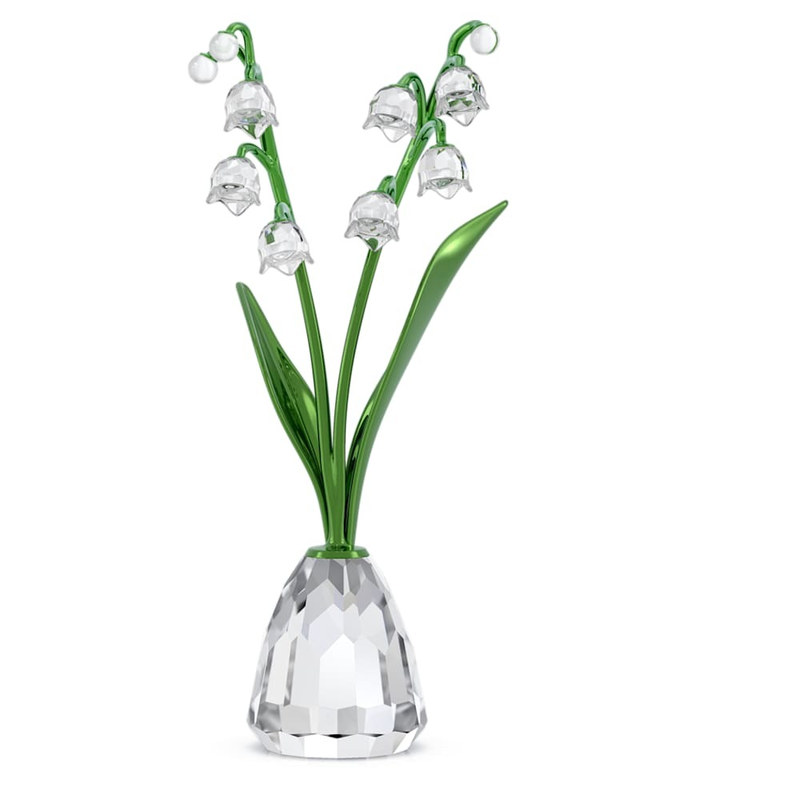

### contact-sheet.jpg

- [ ] Đã mở [references/contact-sheet.jpg](references/contact-sheet.jpg) — 1200×1000.

Tổng quan sáu ảnh Swarovski. Vẫn mở từng ảnh sản phẩm bên dưới.

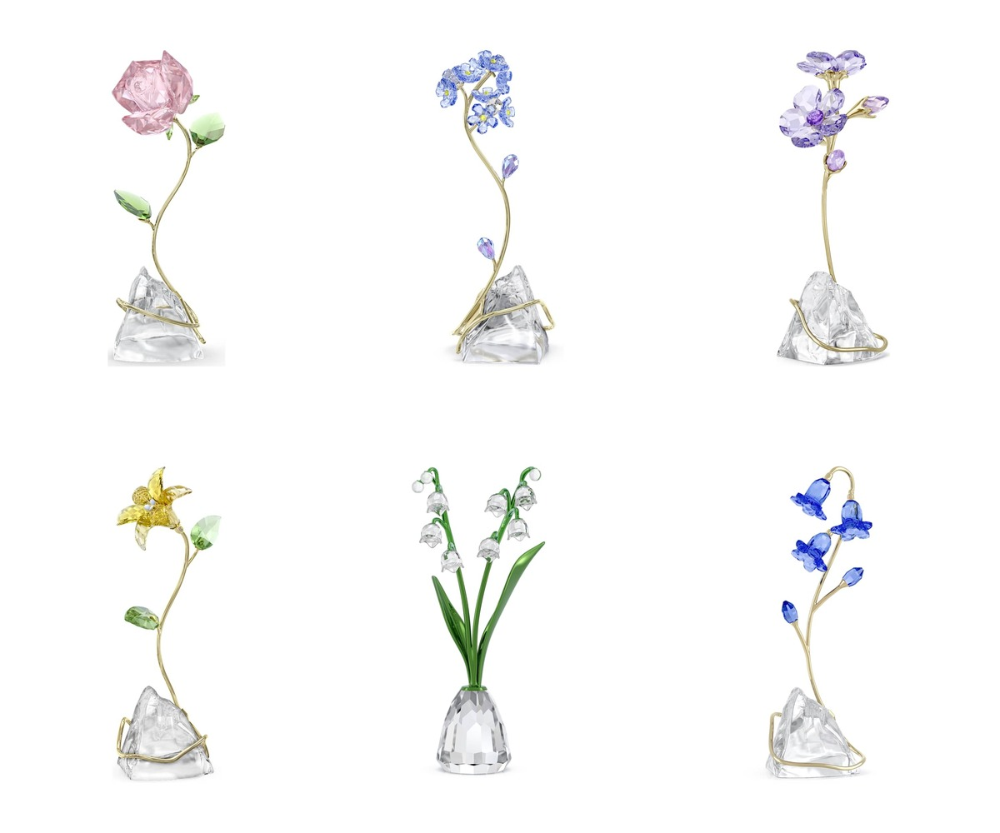

## B. Runtime hiện tại, A/B và phân tích

### 01-current-adaptive.png

- [ ] Đã mở [evidence/01-current-adaptive.png](evidence/01-current-adaptive.png) — 1672×941.

Runtime current, default quality, 1672×941 DPR1. Không phải target.

### 02-high-quality.png

- [ ] Đã mở [evidence/02-high-quality.png](evidence/02-high-quality.png) — 1672×941.

Baseline QA full HDR/transmission/mirror, 1672×941 DPR1; điểm so A/B cùng page.

### 03-post-optical-effects-off.png

- [ ] Đã mở [evidence/03-post-optical-effects-off.png](evidence/03-post-optical-effects-off.png) — 1672×941.

Tắt post optical effects + shafts; tone map/material giữ. Petal body vẫn trắng.

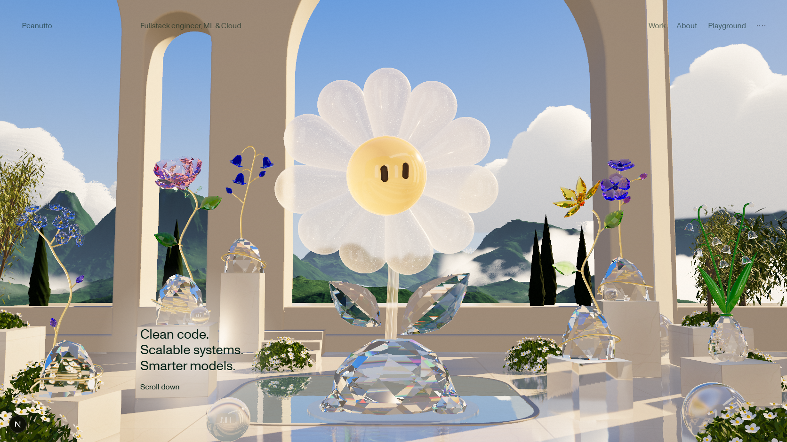

### 04-petal-additions-off.png

- [ ] Đã mở [evidence/04-petal-additions-off.png](evidence/04-petal-additions-off.png) — 1672×941.

Uniform milk/rim multiplier/translucency/glitter off theo nhóm. Hard-coded rimLine vẫn còn; không phải final material.

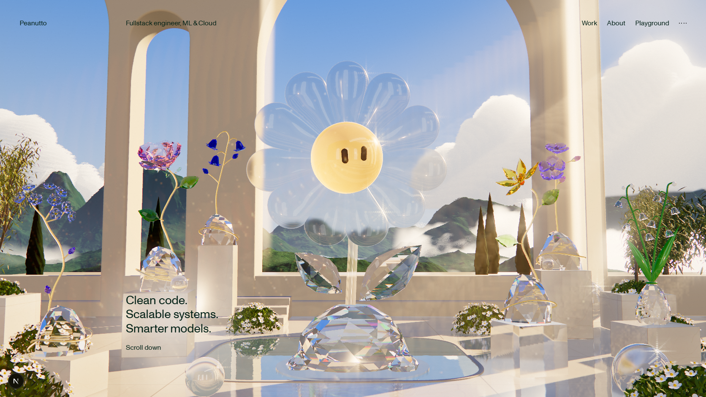

### 05-petal-roughness-008.png

- [ ] Đã mở [evidence/05-petal-roughness-008.png](evidence/05-petal-roughness-008.png) — 1672×941.

Chỉ petal roughness 0.24→0.08. Không chữa được lớp trắng khi glow vẫn bật.

### 06-stem-glow-off.png

- [ ] Đã mở [evidence/06-stem-glow-off.png](evidence/06-stem-glow-off.png) — 1672×941.

Chỉ additive glow của stem hero off. Giữ các vật liệu khác.

### 07-crystal-only-preview.png

- [ ] Đã mở [evidence/07-crystal-only-preview.png](evidence/07-crystal-only-preview.png) — 1672×941.

Browser-only natural Props hidden, IBL/shadows regenerated. Các figurine parts vẫn giữ. Chưa sửa source; preview còn cần relight/composition.

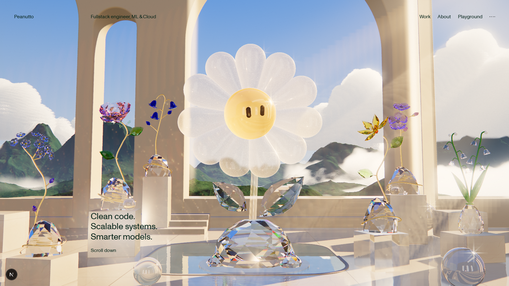

### 08-high-quality-dpr2.png

- [ ] Đã mở [evidence/08-high-quality-dpr2.png](evidence/08-high-quality-dpr2.png) — 3344×1882.

1672×941 CSS, DPR2 =3344×1882 pixels. Mở native crop khi so độ nét; không gọi resize image preview là resolution thật.

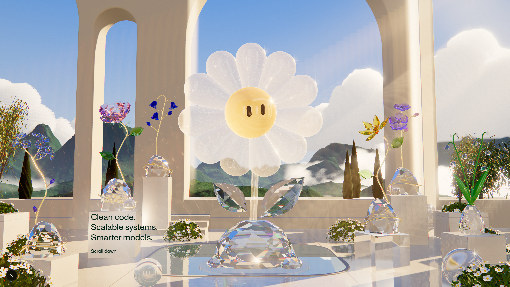

### 09-current-wide-adaptive.png

- [ ] Đã mở [evidence/09-current-wide-adaptive.png](evidence/09-current-wide-adaptive.png) — 2559×1276.

Runtime 2559×1276 DPR1, cùng kích thước screenshot người dùng. Capture lại, không phải file upload gốc.

### 10-current-mobile-adaptive.png

- [ ] Đã mở [evidence/10-current-mobile-adaptive.png](evidence/10-current-mobile-adaptive.png) — 780×1688.

390×844 CSS, DPR2. Browser emulation, không phải benchmark mobile hardware.

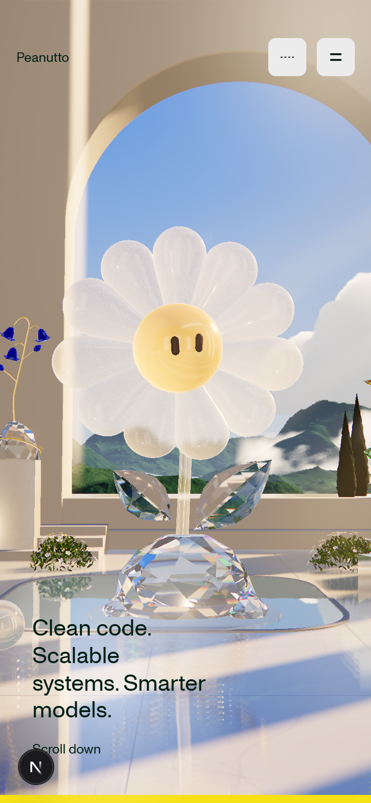

### 11-petal-glow-only-off.png

- [ ] Đã mở [evidence/11-petal-glow-only-off.png](evidence/11-petal-glow-only-off.png) — 1672×941.

Isolation quan trọng nhất: chỉ petal glow scale/ambient off. Lớp trắng giảm mạnh. Không copy thành final quá trong.

### 12-petal-glitter-only-off.png

- [ ] Đã mở [evidence/12-petal-glitter-only-off.png](evidence/12-petal-glitter-only-off.png) — 1672×941.

Chỉ uGlitter=0; rimLine hard-coded vẫn còn. Giảm noise, body vẫn trắng.

### 13-petal-milk-rim-only-off.png

- [ ] Đã mở [evidence/13-petal-milk-rim-only-off.png](evidence/13-petal-milk-rim-only-off.png) — 1672×941.

Chỉ milk desaturation/rim multiplier off, glow và glitter giữ; khác ít hơn glow-off.

### 14-current-hero-native.png

- [ ] Đã mở [evidence/14-current-hero-native.png](evidence/14-current-hero-native.png) — 500×790.

Crop1:1 current hero, không sharpen/upscale/chỉnh màu.

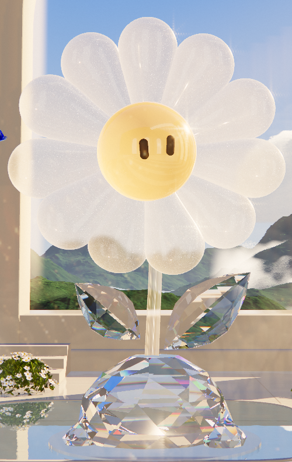

### 15-original-hero-native.png

- [ ] Đã mở [evidence/15-original-hero-native.png](evidence/15-original-hero-native.png) — 500×790.

Crop1:1 original, cùng rectangle với current. Đánh giá frost/rim/stem/base.

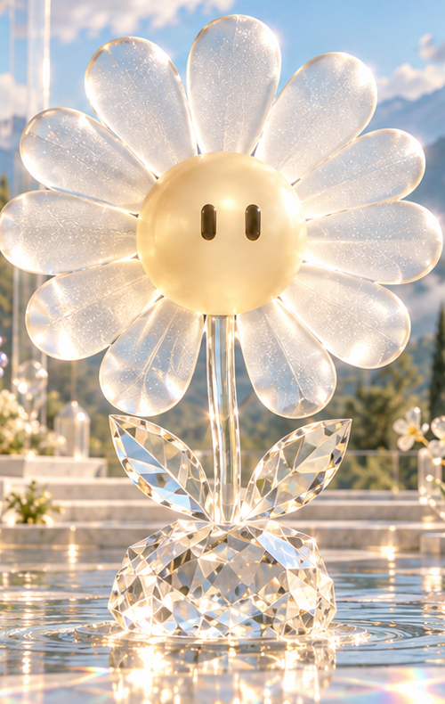

### 16-real-white-shrub-runtime-crop.png

- [ ] Đã mở [evidence/16-real-white-shrub-runtime-crop.png](evidence/16-real-white-shrub-runtime-crop.png) — 391×220.

Crop lại vùng hoa trắng thật mà người dùng chỉ ra. Không phải raw attachment2. Xóa factory shrub/blossom, giữ crystal gần đó.

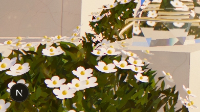

### 17-real-olive-and-crystal-runtime-crop.png

- [ ] Đã mở [evidence/17-real-olive-and-crystal-runtime-crop.png](evidence/17-real-olive-and-crystal-runtime-crop.png) — 725×740.

Crop runtime tương ứng phàn nàn bên trái. Xóa olive/cypress, giữ Forget-me-not/Rose/gold wires. Không phải raw attachment3.

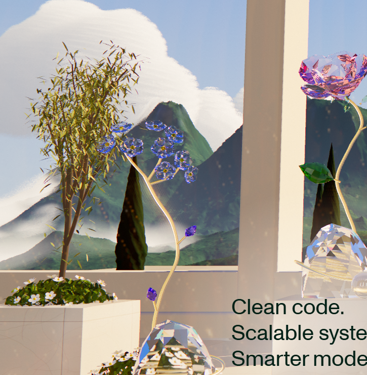

### 18-crystal-figurine-green-parts-keep.png

- [ ] Đã mở [evidence/18-crystal-figurine-green-parts-keep.png](evidence/18-crystal-figurine-green-parts-keep.png) — 210×350.

GIỮ tượng Lily of the Valley kể cả green lacquer. Olive/shrub phía sau nó phải xóa theo ownership, không xóa toàn rectangle.

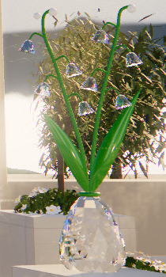

### 19-original-vs-current-hero.png

- [ ] Đã mở [evidence/19-original-vs-current-hero.png](evidence/19-original-vs-current-hero.png) — 1036×900.

Bảng so original trái/current phải; native crop không retouch.

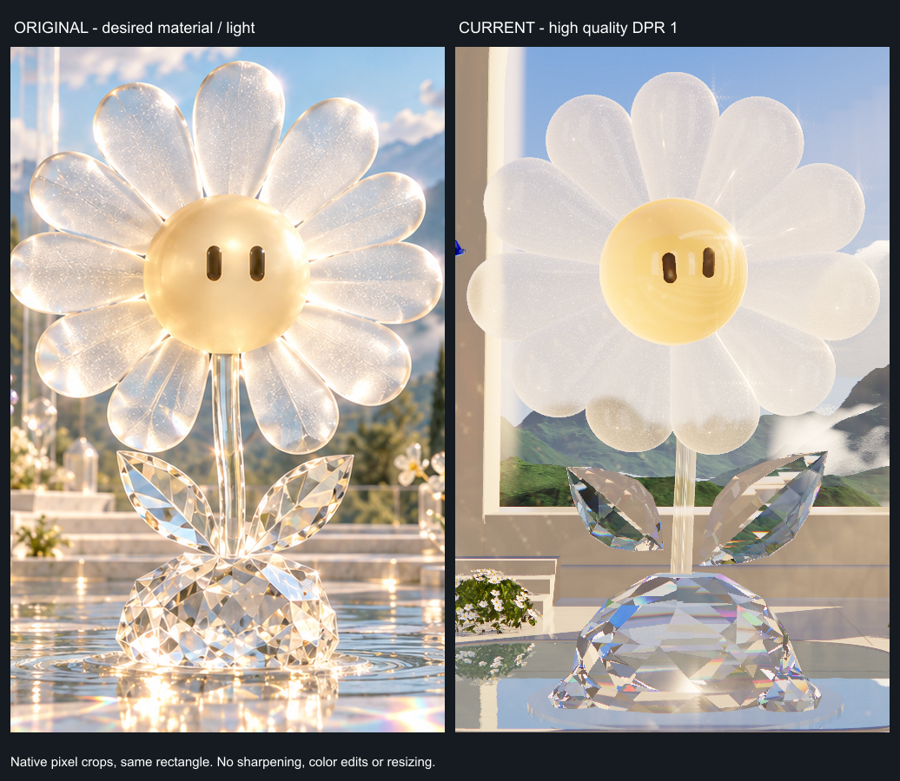

### 20-petal-isolation-contact-sheet.png

- [ ] Đã mở [evidence/20-petal-isolation-contact-sheet.png](evidence/20-petal-isolation-contact-sheet.png) — 1428×1064.

6 native crops A/B: baseline, glow, glitter, milk/rim, roughness, post. Bảng không thay thế ảnh full.

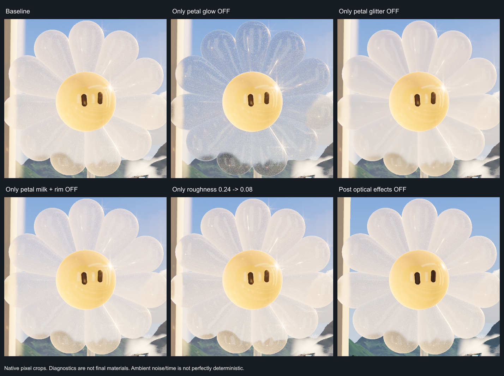

### 21-stem-glow-native-comparison.png

- [ ] Đã mở [evidence/21-stem-glow-native-comparison.png](evidence/21-stem-glow-native-comparison.png) — 948×440.

Original/current/stem-glow-off — crop1:1, không color grade.

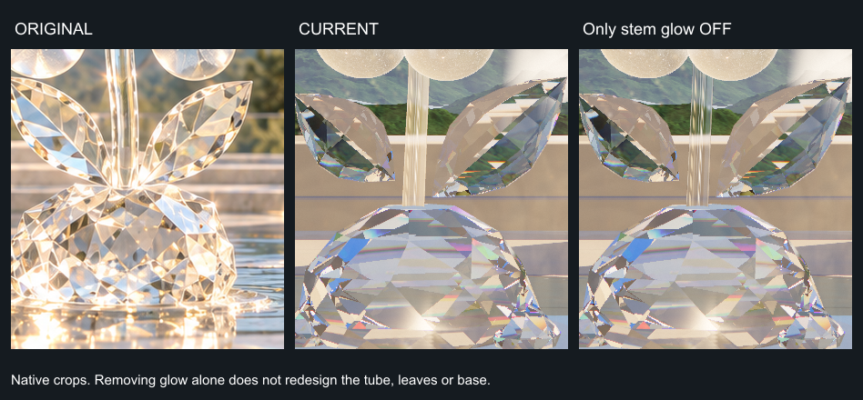

### 22-remove-natural-keep-crystal-map.png

- [ ] Đã mở [evidence/22-remove-natural-keep-crystal-map.png](evidence/22-remove-natural-keep-crystal-map.png) — 1672×941.

Đỏ=natural Props cần bỏ; xanh=figurine parts cần giữ. Chú thích vùng, KHÔNG PHẢI segmentation mask.

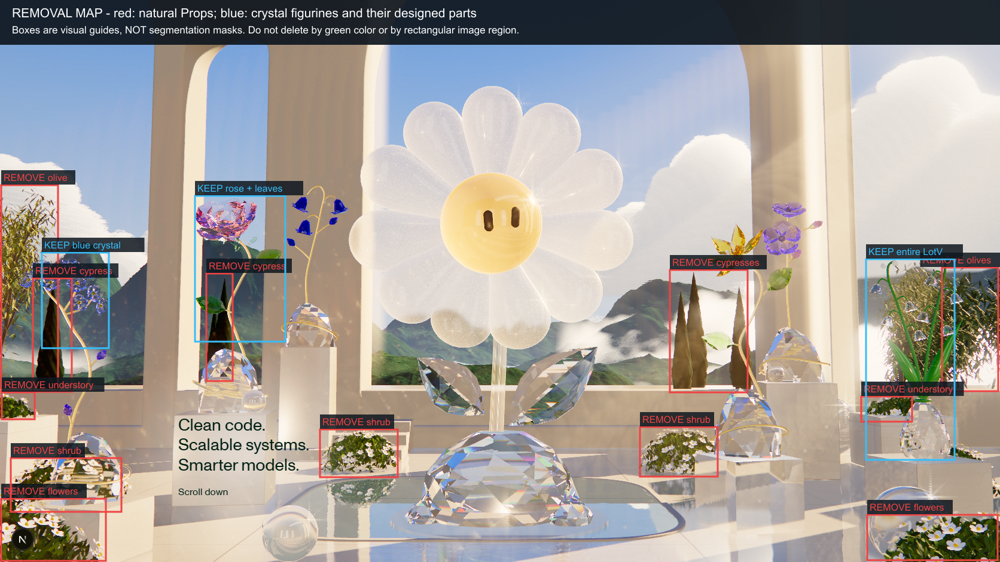

## C. Lịch sử TRƯỚC sửa — không phải hiện trạng

### 01-baseline.png

- [ ] Đã mở [history/before/01-baseline.png](history/before/01-baseline.png) — 1672×941.

historical pre-implementation. Mở để nhận biết tiến bộ; kết luận lỗi cũ có thể đã được sửa. Không copy baseline này làm đích.

### 02-existing-debug-glass.png

- [ ] Đã mở [history/before/02-existing-debug-glass.png](history/before/02-existing-debug-glass.png) — 1672×941.

historical pre-implementation. Mở để nhận biết tiến bộ; kết luận lỗi cũ có thể đã được sửa. Không copy baseline này làm đích.

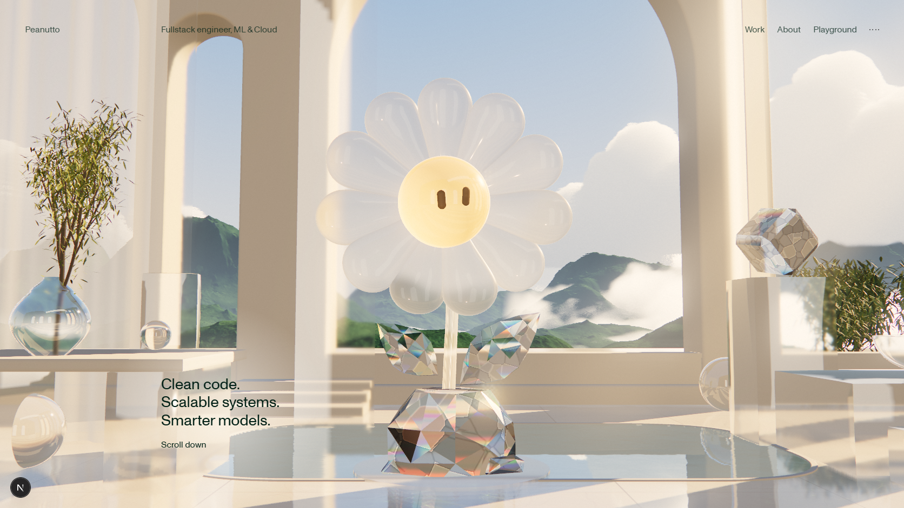

### 03-all-facet-effects-off.png

- [ ] Đã mở [history/before/03-all-facet-effects-off.png](history/before/03-all-facet-effects-off.png) — 1672×941.

historical pre-implementation. Mở để nhận biết tiến bộ; kết luận lỗi cũ có thể đã được sửa. Không copy baseline này làm đích.

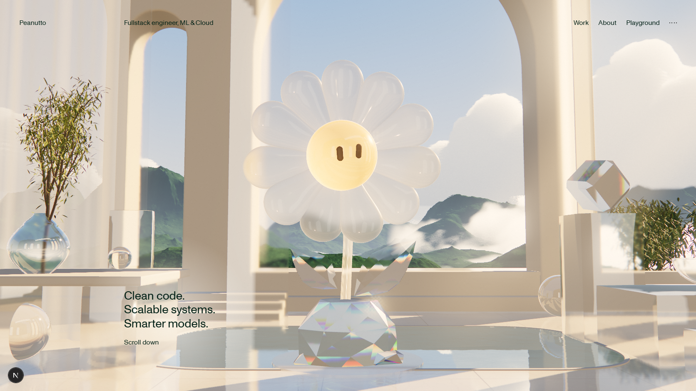

### 04-unpatched-crystal-diagnostic.png

- [ ] Đã mở [history/before/04-unpatched-crystal-diagnostic.png](history/before/04-unpatched-crystal-diagnostic.png) — 1672×941.

historical pre-implementation. Mở để nhận biết tiến bộ; kết luận lỗi cũ có thể đã được sửa. Không copy baseline này làm đích.

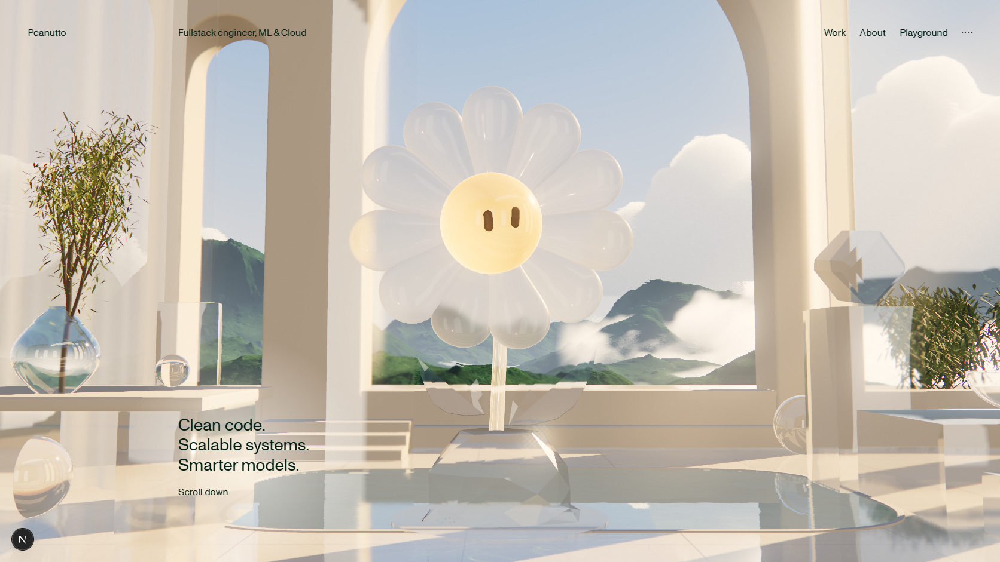

## D. Lần capture SAU sửa của Claude — lịch sử, không phải target

### 01-final.png

- [ ] Đã mở [history/claude-after/01-final.png](history/claude-after/01-final.png) — 1672×941.

previous Claude implementation capture. Mở để nhận biết tiến bộ; kết luận lỗi cũ có thể đã được sửa. Không copy baseline này làm đích.

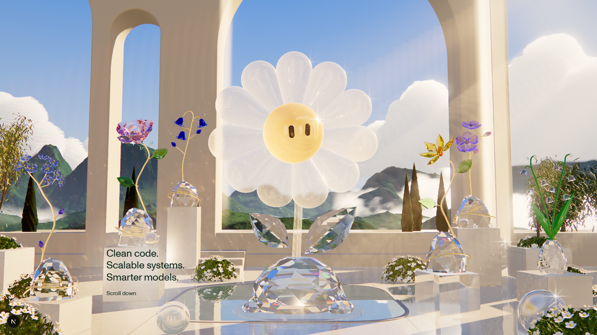

### 02-bloom-off.png

- [ ] Đã mở [history/claude-after/02-bloom-off.png](history/claude-after/02-bloom-off.png) — 1672×941.

previous Claude implementation capture. Mở để nhận biết tiến bộ; kết luận lỗi cũ có thể đã được sửa. Không copy baseline này làm đích.

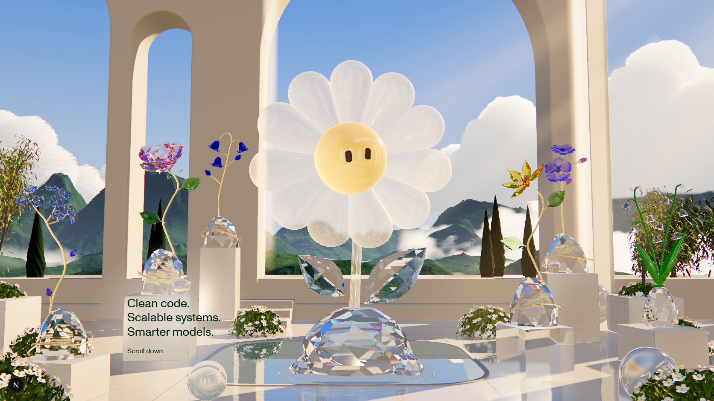

### 03-debug-glass.png

- [ ] Đã mở [history/claude-after/03-debug-glass.png](history/claude-after/03-debug-glass.png) — 1672×941.

previous Claude implementation capture. Mở để nhận biết tiến bộ; kết luận lỗi cũ có thể đã được sửa. Không copy baseline này làm đích.

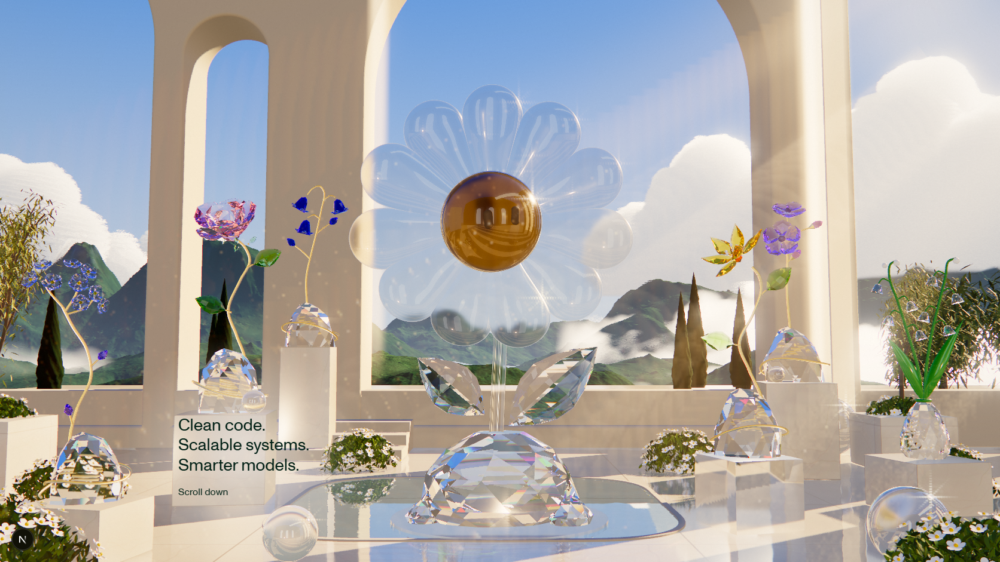

### 04-debug-unpatched.png

- [ ] Đã mở [history/claude-after/04-debug-unpatched.png](history/claude-after/04-debug-unpatched.png) — 1672×941.

previous Claude implementation capture. Mở để nhận biết tiến bộ; kết luận lỗi cũ có thể đã được sửa. Không copy baseline này làm đích.

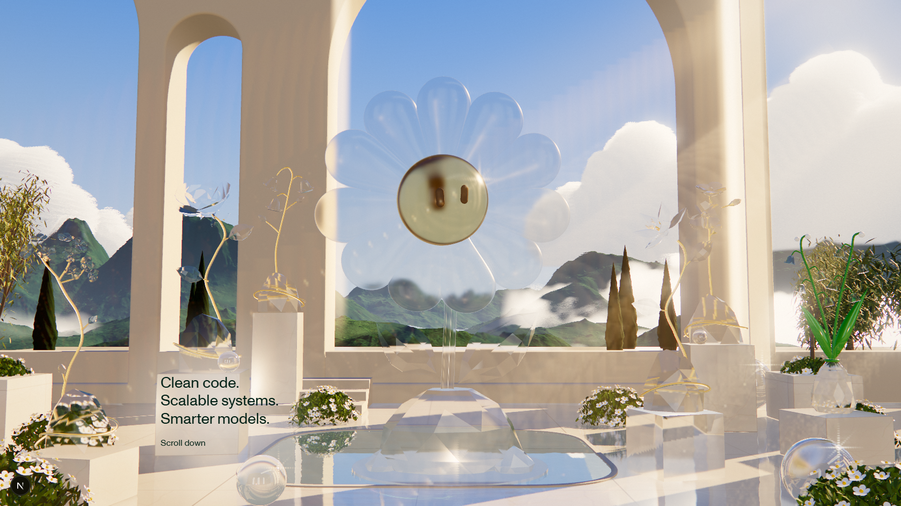

### 05-florere-lineup.png

- [ ] Đã mở [history/claude-after/05-florere-lineup.png](history/claude-after/05-florere-lineup.png) — 3344×1882.

previous Claude implementation capture. Mở để nhận biết tiến bộ; kết luận lỗi cũ có thể đã được sửa. Không copy baseline này làm đích.

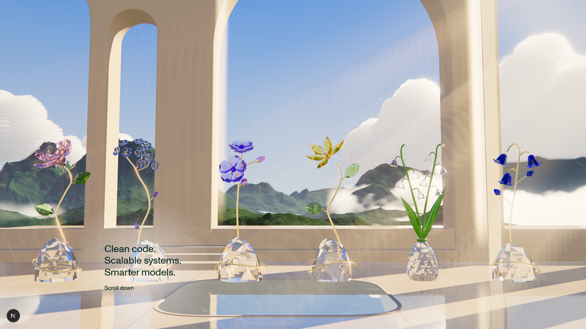

### 06-wide-2560.png

- [ ] Đã mở [history/claude-after/06-wide-2560.png](history/claude-after/06-wide-2560.png) — 2560×1264.

previous Claude implementation capture. Mở để nhận biết tiến bộ; kết luận lỗi cũ có thể đã được sửa. Không copy baseline này làm đích.

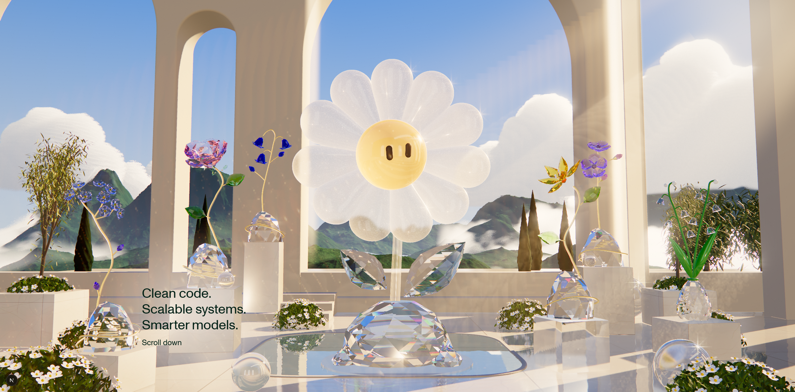

### 07-mobile.png

- [ ] Đã mở [history/claude-after/07-mobile.png](history/claude-after/07-mobile.png) — 780×1688.

previous Claude implementation capture. Mở để nhận biết tiến bộ; kết luận lỗi cũ có thể đã được sửa. Không copy baseline này làm đích.

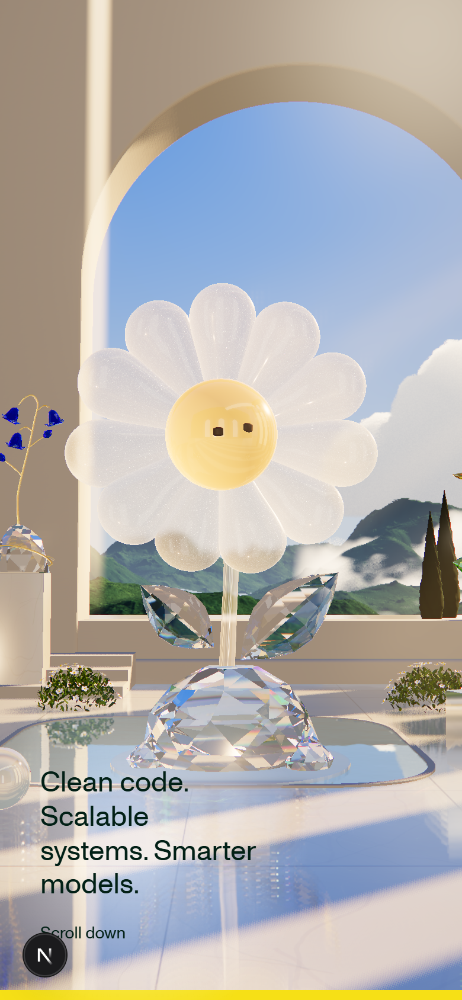

### 08-tablet.png

- [ ] Đã mở [history/claude-after/08-tablet.png](history/claude-after/08-tablet.png) — 1024×768.

previous Claude implementation capture. Mở để nhận biết tiến bộ; kết luận lỗi cũ có thể đã được sửa. Không copy baseline này làm đích.

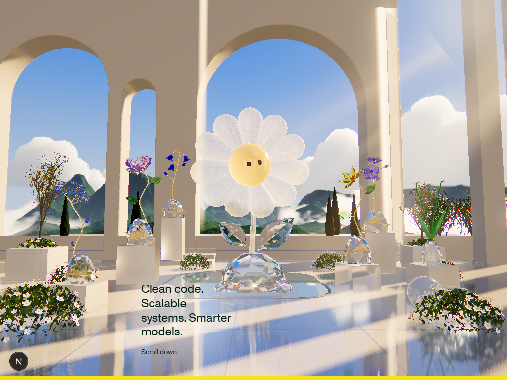

