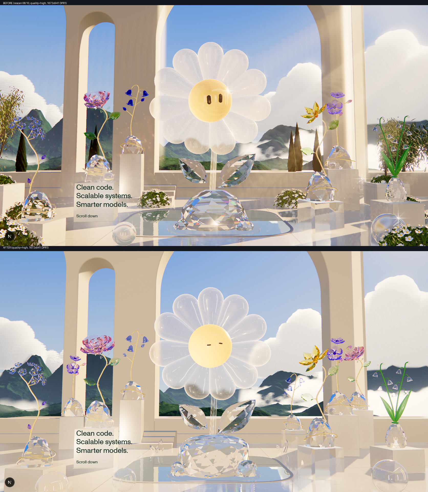
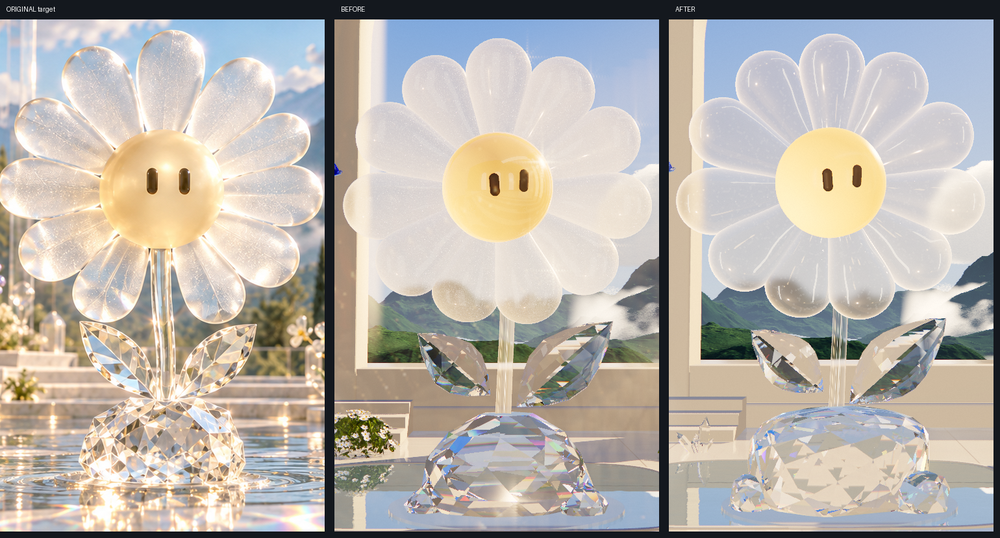

# Triển khai theo rescan 08/10

Phạm vi: [CLAUDE_HANDOFF.md](CLAUDE_HANDOFF.md) 08/10 và phản hồi của người dùng cùng ngày: tia sáng dựng thêm và chớp sao trên crystal nhìn giả; hoa còn ít, chưa đẹp; đích là ảnh original cuối. Giữ Three.js, `WebglManager`, rig/intro/transition, copy DOM, home/about.

## Trước / sau

| | |
|---|---|
|  |  |

Trái: ảnh rescan `evidence/02` và [after/02-high](after/02-high.png), cùng 1672×941 DPR1, `quality=high`. Phải: crop gốc 1:1 cùng khung 500×790, gồm original, trước và sau.

## Đã làm, theo checkpoint

**1. Xóa thực vật thật** (`props.ts`, `layout.ts`). Đã bỏ khỏi bước dựng scene: olive trong chậu, cây bụi dưới chậu, đất, sáu bụi hoa trắng, cypress, olive xa, cùng helper, vật liệu và animation lắc cây. Không còn chậu rỗng. Props giờ chỉ còn cầu kính và hai cụm thạch anh traced phía sau hồ. Sáu Florere giữ nguyên toàn bộ bộ phận, gồm lá crystal, dây vàng và thân/lá xanh lacquer của Lily of the Valley. IBL, shadow và mirror được dựng lại từ đầu sau khi xóa, nên không có bóng hay phản chiếu ma. Inventory runtime: 110 mesh; draw instanced lớn nhất là 45 cánh crystal (trước đây là hàng nghìn lá cây). Xem [capture.json](after/capture.json).

**2. Bỏ tia sáng và chớp sao giả** (ảnh 1 và 2 người dùng khoanh). Đã xóa `world.ts` (`SunShafts`: các tấm phẳng additive), pass light-shaft 1/4 độ phân giải và star streaks trong `post.ts` / `shaders/crystal.ts`. Bloom giờ chỉ bắt glint thật: ngưỡng 2.6 → 5, trọng số .12/.1/.08 → .08/.05/.025. Glare góc phải đặt theo vị trí mặt trời chiếu thật và thu nhỏ quầng. Halo rộng cũ làm bạc lá Lily of the Valley: so `03-bloom-off` với `01`. Sharpen .45 → .3.

**3. Ánh sáng.** Mặt trời chuyển ra sau pavilion, ngay ngoài góc trên phải, như original: hoa và crystal được chiếu ngược, viền sáng lên. Fill bầu trời và ánh dội từ sàn được tăng để mặt trước không tối. Lightformers capture: bỏ khung cửa vòm (nguyên nhân các vòng lặp trên orb); thêm hai dải đứng rất sáng (cánh daisy bắt thành vệt highlight dài), dải trên và 22 điểm sáng ấm cho lấp lánh trong mặt cắt.

**4. Cánh daisy** (`materials.ts`, `shaders/crystal.ts`). Translucency được tách thành ba phần điều khiển riêng: thân (`body`), viền và ambient. Với cánh, glow chỉ còn ở viền dày (`body` .1), nên thân không bị phủ trắng; orb vẫn sáng cả khối (`body` 1). Rim line trong glitter chunk giờ là `uGlitterRim` riêng, và `debug=glass` đã tắt được. Glitter giờ lọc theo footprint: mỗi lớp hạt mờ dần trước khi một hạt nhỏ hơn khoảng 1.5 px, nên không bò hay nhấp nháy ở DPR1. Mật độ hạt giảm và không còn nền cộng sáng. Cánh: roughness .32 (frost), milk .22, edge −.9 (viền sáng), clearcoat 1.

**5. Stem, orb, lá và đế hero.** Stem: glow chỉ còn ở viền (scale .12, ambient .02), attenuation nhạt hơn. Orb: satin (roughness .34), envMap .7, không còn vòng cửa sổ phản chiếu. Đế: `facetedRock` gồm khoảng 180 mặt hướng đều mọi phía, theo phân bố xoắn Fibonacci, thay cho cushion có tầng đều; tier lite dùng khoảng 100 mặt. Lá: 9 hàng mặt cắt thay vì 6.

**6. Figurines** (`florere/species.ts`). Rose: bốn vòng cánh (4/5/5/5) quanh lõi xoắn, đầy đặn như hoa hồng nở. Lily: sáu cánh rộng hơn, mở hơn. Màu crystal giờ hấp thụ theo đơn vị vật thể (`crystalTrace.ts`), nên không còn đậm lên khi phóng to figurine. Đã hiệu chỉnh lại theo ảnh sản phẩm: bellflower không còn là mảng cobalt đen, lá xanh nhạt hơn.

**7. Bố cục.** Sáu Florere chính, cộng ba bản lặp ở lớp sau (Rozanne trái, Rose phải, Bellflower giữa phải) để vườn có nhiều lớp. Các bản lặp bị bỏ trên tier lite. Không thêm Iris, Tulip hay Hydrangea.

**8. Hạ tầng tracer.** Face planes đọc từ float texture thay cho mảng uniform, nên không còn giới hạn uniform trên mobile. Texture được dispose qua `disposeMaterial()`. `traceScreen` bỏ early return và kênh R/G/B được viết tách riêng, nên hết 8 warning D3D X4000 của tracer.

**9. Daisy theo tỷ lệ home/about** (yêu cầu bổ sung). Đã đo trực tiếp mesh `TexFleur` (giải nén Draco từ `scene_v9.glb`; about `scene_v15.glb` là cùng một sculpt). Daisy playground dựng lại theo số đo đó:
- Đầu: 12 cánh giống hệt nhau, cách đều 30°, bắt đầu từ cánh thẳng đứng. Mỗi cánh dài 0.80 (r 0.378 → 1.178), rộng 0.27 ở gốc và 0.43 ở chỗ rộng nhất, đầu tròn, dày 0.17 → 0.26, đầu cánh cong ra trước 0.075.
- Mặt: vòm Ø 0.885, nhô 0.241 trước vành; gốc cánh nằm sau vành vòm.
- Thân: thẳng nhìn từ trước, Ø 0.058.
- Lá: 0.85 × 0.45, nghiêng khoảng 37°, lá phải thấp hơn lá trái.
- Đế: một khối đá có thành gần đứng và mặt trên cắt dốc, rộng 1.46 × cao 0.72.

Mắt dùng đúng hệ bloub của home/about: phần animation (montage, expression, blink, theo con trỏ) được tách sang `eyes/faceDriver.ts`. `FlowerFace` (home/about) và `OrbFace` mới (vẽ mắt trên vòm champagne) dùng chung phần này.

## Evidence ([after/](after/), tạo lại bằng `node scripts/capture-playground-crystal.mjs`)

| Ảnh | URL / thiết lập | HDR | Mirror | Transmission |
|---|---|---|---|---|
| `01-default` (+ crops hero/petals/stem/rose/lily/lotv) | `?skipLoader&debug=probe`, 1672×941 DPR1 | 1672×941 | 1003×565 | 0.8 |
| `02-high` (+ crops) | `&quality=high` | 1672×941 | 1672×941 mỗi frame | 1 |
| `03-bloom-off` | high; bloom 0, glare 0 | " | " | 1 |
| `04-petal-glow-off` | high; chỉ `uTransScale/uTransAmbient` của cánh = 0 | " | " | 1 |
| `05-petal-glitter-off` | high; chỉ `uGlitter` = 0 (rim line vẫn còn) | " | " | 1 |
| `06-petal-rim-off` | high; chỉ `uGlitterRim` = 0 | " | " | 1 |
| `07-debug-glass` | `debug=glass`: glitter, rim, milk, translucency, sun glint tracer đều = 0 (patch vẫn compile) | " | " | 1 |
| `08-debug-unpatched` | `debug=unpatched`: patched → `MeshPhysicalMaterial` gốc (đổi cả vài thuộc tính, không phải A/B một biến) | " | " | 1 |
| `09-florere-lineup` | `debug=florere`, DPR2 | 3344×1882 | 3344×1882 | 1 |
| `10-high-dpr2` | high, DPR2 | 3344×1882 | 3344×1882 | 1 |
| `11-wide-2559` | 2559×1276 DPR1 | 2559×1276 | 1535×766 | 0.8 |
| `12-mobile` | 390×844 DPR2 (emulation, tier lite) | 780×1688 | 312×675 | 0.5 |
| `13-tablet` | 1024×768 (tier lite) | 1024×768 | 410×307 | 0.5 |

Tất cả `renderScale` = 1. `sequence/`: 28 frame intro không skipLoader (loader tới khoảng 4.0 s, thẻ mở khoảng 4.9 s, dolly và daisy mở 5.8–7.2 s), 8 frame hero khi pointer quét (không thấy glitter bò; vệt mờ ở frame 4–5 là hiệu ứng fluid/velocity sẵn có của site), điều hướng home → playground → about → playground, và resize 1100/1000/1400 px.

Đo trên RTX 4070 SUPER, Chromium/ANGLE D3D11, dev build: từ `update()` đến `gl.finish()` khoảng 4 ms/frame (trước: khoảng 2.5 ms; tăng do đế hero và mặt cắt mịn hơn). `gl.finish` là xấp xỉ, không phải GPU timer. Chưa đo trên GPU tích hợp hay điện thoại thật.

Console: không có error. Còn 5 warning D3D: X4122 (độ chính xác hằng số), X3595 (gradient trong loop, đã có từ audit 07/10) và 3 X4000 `dyn_index_vec3`. Ba warning cuối nằm ngoài tracer; nhiều khả năng đến từ vòng dispersion của three, nhưng chưa xác minh. `npm run check` pass.

## Ảnh đã mở trong lần này

Original `00`, boards `01/02`, `03` previous project, contact sheet sáu sản phẩm; runtime `01–14`, `16–22`, `15` (crop original); lịch sử `before/02`, `before/03`. Sáu ảnh sản phẩm riêng lẻ được xem ở phiên 07/10; lần này đối chiếu qua contact sheet.

## Khớp / chưa khớp với original

Khớp hơn: không còn cây thật; không còn tia sáng dựng hay chớp sao; cánh daisy trong-frost, viền sáng, có vệt highlight; stem đọc là kính; đế và lá nhiều mặt cắt sáng/tối; nắng ngược từ góc trên phải; sáu loài nhận ra được ở kích thước thật.

Chưa khớp:
- Original có không khí "golden hour" rất sáng, lấp lánh dày, bokeh và cầu vồng trên sàn nước. Bản realtime sáng ít hơn, đế hero ít điểm sáng vàng hơn.
- Thân cánh vẫn đục hơn original một chút.
- Đế Florere là khối lồi nhiều mặt, chưa phải đá trơn như sản phẩm.
- Original có cầu thang marble và nhiều tầng bệ hơn.

## Giới hạn quang học còn lại

- Mỗi crystal chỉ truy vết trong chính nó. Không có khúc xạ qua crystal hay cánh khác, nên cánh rose không nhìn xuyên qua nhau.
- Các lần thoát sau lần đầu lấy PMREM 256 chụp tại đầu daisy, nên không có parallax cục bộ.
- Cánh, chuông và nụ là chip lồi: không có cánh cong ngược hay lòng chuông rỗng.
- Caustic sàn vẫn là pattern thủ tục.
- Glitter là hạt cố định trong không gian vật thể, không phải tán xạ thật.
